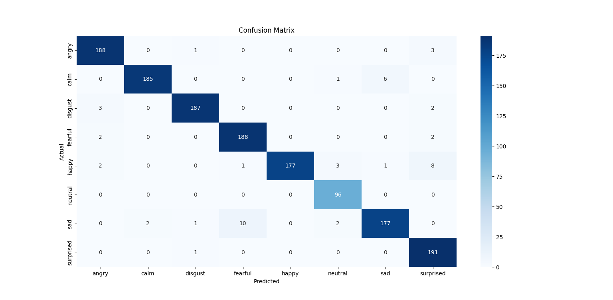
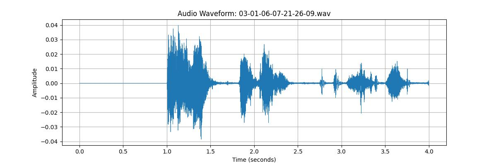

<h1 align="center">🎙️ Emotion Detection from Raw Audio Waveform</h1>

<p align="center">
  <b>Detect human emotions from raw .wav files using deep learning and pretrained speech models.</b><br>
  Built using Hugging Face Transformers, PyTorch, and Torchaudio.
</p>

---

## 🚀 Overview

This project classifies human emotions like **Happy**, **Sad**, **Angry**, and **Neutral** directly from raw audio (`.wav`) files. It utilizes a Hugging Face pretrained model fine-tuned on the **RAVDESS** emotional speech dataset. The entire process—from preprocessing to training and inference—can be run using simple Python scripts.

---
## 📚 Table of Contents

- [🚀 Overview](#-overview)
- [🧠 How the Model Works](#-how-the-model-works)
- [📁 Project Structure](#-project-structure)
- [🛠️ Installation](#️-installation)

### 🎯 Recreate the Model (Step-by-Step)
- [Step 1: Preprocess the Dataset](#-step-1-preprocess-the-dataset)
- [Step 2: Train the Classifier](#-step-2-train-the-classifier)
- [Step 3: Run Inference](#-step-3-run-inference)

### 🧪 Sample Output
- [📊 Classification Report](#1-classification-report)
- [🔍 Prediction Output](#2-prediction-output)
- [📉 Confusion Matrix](#3-confusion-matrix)
- [📈 Wave-Output](#4-wave-output)

- [🔍 Model Details](#-model-details)
- [🌟 Features](#-features)
- [📦 Requirements](#-requirements)
- [💡 Future Ideas](#-future-ideas)
- [👨‍💻 Author](#-author)

---
## 🧠 How the Model Works

1. **Raw Audio Input**  
   You input a mono `.wav` file recorded at any sample rate.

2. **Preprocessing**  
   The audio is normalized and resampled to 16kHz using `torchaudio`.

3. **Feature Extraction**  
   The pretrained **HuBERT** model (from Hugging Face) extracts deep audio embeddings.

4. **Classifier Head**  
   A dense neural network is trained on top of these embeddings using labeled emotion data (RAVDESS).

5. **Prediction**  
   The model outputs the most probable emotion class for the given voice input.

---

## 📁 Project Structure

```
Emotion_detection_by_wave_formate/
├── audio_waveform_viewer.py     # Displays waveform of audio files
├── preprocess_ravdess.py        # Prepares RAVDESS dataset
├── train_emotion_model.py       # Trains the classifier on HuBERT embeddings
├── predict_emotion.py           # Predicts emotion for new audio input
├── model/
│   └── final_emotion_model/     # Trained model is saved here
├── dataset/                     # Raw and processed audio files
├── sample_output/               # Store screenshots and predictions
├── requirements.txt             # All required dependencies
└── README.md                    # You are here!
```

---

## 🛠️ Installation

### 1. Clone the Repository

```bash
git clone https://github.com/dhanesh-j/Emotion_detection_by_wave_formate.git
cd Emotion_detection_by_wave_formate
```

### 2. Install Dependencies

```bash
pip install -r requirements.txt
```

---

## 🎯 Recreate the Model (Step-by-Step)

### 🔹 Step 1: Preprocess the Dataset

Ensure RAVDESS dataset is available under `dataset/RAVDESS/`

```bash
python preprocess_ravdess.py --input_dir dataset/RAVDESS/ --output_dir dataset/processed/ --sample_rate 16000
```

### 🔹 Step 2: Train the Classifier

```bash
python train_emotion_model.py   --data_dir dataset/processed/   --pretrained_model superb/hubert-large-superb-er   --output_dir model/final_emotion_model/
```

### 🔹 Step 3: Run Inference

```bash
python predict_emotion.py --model_dir model/final_emotion_model/ --input_audio sample_output/sample.wav
```

---

## 🧪 Sample Output

Here’s a visual summary of the model's performance across different emotions:

### 1. Classification Report

The graph shows high precision and recall for emotions like *Sad* and *Neutral*, with consistent accuracy across all categories.

### 2.Prediction Output

The above image represents the Emotion Detected after analysing the audio in realtime (live recorded audio).

### 3.Confusion Matrix

The above image represents the confusion matrix of the model

### 4. Wave-Output


The above image represents the Realtime Wave-Form of Recorded audio, measured by Time / Seconds.

---

## 🔍 Model Details

- **Backbone**: [`superb/hubert-large-superb-er`](https://huggingface.co/superb/hubert-large-superb-er)
- **Dataset**: [RAVDESS](https://zenodo.org/record/1188976)
- **Input**: Raw waveform
- **Output**: Emotion class (`happy`, `sad`, `angry`, `neutral`)

---

## 🌟 Features

- ✅ No speech-to-text required
- ✅ Lightweight training using pretrained embeddings
- ✅ Easily extendable with other datasets
- ✅ Compatible with Gradio or Streamlit for UI

---

## 📦 Requirements

- Python 3.8+
- torch
- torchaudio
- transformers
- librosa
- matplotlib

Install them using:

```bash
pip install -r requirements.txt
```

---

## 💡 Future Ideas

- 🎤 Real-time microphone support
- 🌐 Multilingual emotion detection
- 📊 Interactive dashboard with waveform + prediction
- 🧪 Confusion matrix and training metrics visualization

---

## 👨‍💻 Author

**Dhanesh J. & Akash Krishnan**  
Third-year mini project Computer Science student passionate about AI, voice recognition, and applied ML.
